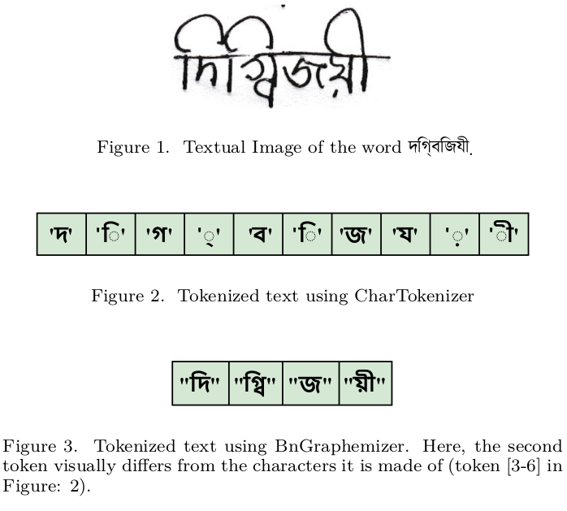

# BnGraphemizer: Bengali TRIE-based tokenizer

- To be used in Text Recognition, Speech Recognition, Text to Speech Generation System
- It works on 'provided' set of vocabulary, making it useful for many NLP systems

## Installation

Run
`
pip install git+https://github.com/Jahid006/BnGraphemizer
` to install the package directly

Related papers: [BnGraphemizer: A Grapheme-based Tokenizer for Bengali Handwritten Text Recognition](https://www.researchgate.net/publication/378148698_BnGraphemizer_A_Grapheme-based_Tokenizer_for_Bengali_Handwritten_Text_Recognition)
